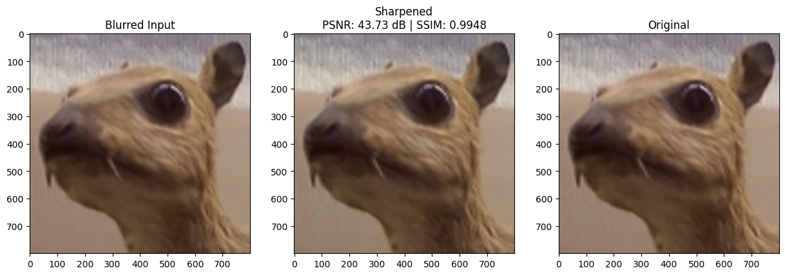

#Sample Results: Image Sharpening using Knowledge Distillation

This document presents sample visual comparisons from the image sharpening pipeline built using Knowledge Distillation. The goal is to demonstrate how effectively the student model replicates the teacher model's ability to enhance image sharpness.

Each comparison includes:
The input blurry image.
The output generated by the teacher model, a large and accurate neural network.
The output from the student model, trained using distilled knowledge from the teacher.

Below is a comparison of the blurred input, the output after sharpening using the student model, and the original image. This sample achieves a PSNR of 43.73 dB and an SSIM of 0.9948, demonstrating the student model's ability to recover fine details with high fidelity.

##Observations

The student model produces outputs that closely resemble those of the teacher model. Despite being lighter and more efficient, it retains key structural and perceptual details in the sharpened images.
Edges, textures, and contrast are effectively restored. While subtle differences can be noticed in some cases, they are minimized due to the combined use of loss functions such as LPIPS and SSIM, which ensure both pixel-level and perceptual fidelity.
These results were generated using sample inputs from the data/ folder and processed through models trained using the Final_ISKD.ipynb notebook.

